<!-- ============ MATRIX HEADER ============ -->

 

<h1 style="font-family:'Fira Code',Consolas,monospace;font-size:34px;letter-spacing:8px;color:#FFFFFF;margin:24px 0 4px;text-transform:uppercase;">Hishan Khan</h1>

root@developer:~ — AI + Cloud Engineer

Building intelligent systems at the intersection of Generative AI, Google Cloud, and the web.

 

<!-- ============ SHIELDS ============ -->

 

<!-- ============ 01 · WHOAMI ============ -->

  01 // WHOAMI

  <pre style="font-family:'Fira Code',Consolas,monospace;font-size:13.5px;line-height:1.9;color:#00FF41;background-color:#050505;border:1px solid #1F2D1F;border-radius:12px;padding:22px 26px;text-align:left;overflow-x:auto;margin:0;">
root@developer:~# whoami
hishan-khan

root@developer:~# cat ~/.bio

  role:   AI + Cloud Engineer
  focus:  Generative AI / Vertex AI / Gemini / Cloud Run
  stack:  Python · JavaScript · TypeScript · React · Next.js
  status: &gt; ONLINE — learning mode: permanently engaged

root@developer:~# ACCESS_GRANTED._
  </pre>

 

<!-- ============ 02 · SYSTEM.STATS ============ -->

  02 // SYSTEM.STATS

  
  &nbsp;&nbsp;&nbsp;&nbsp;
  

  

 

<!-- ============ 03 · SKILLS ============ -->

  03 // SKILL.MATRIX

<table align="center" cellspacing="0" cellpadding="0" style="max-width:860px;width:100%;border-collapse:separate;border-spacing:12px;margin:18px auto 0;">
  <tr>
    <td style="width:50%;vertical-align:top;background-color:#050505;border:1px solid #1F2D1F;border-radius:12px;padding:18px 20px;text-align:left;">
      
LANG.CORE

      PYTHON
      C
      JS
      TS
      SQL
    </td>
    <td style="width:50%;vertical-align:top;background-color:#050505;border:1px solid #1F2D1F;border-radius:12px;padding:18px 20px;text-align:left;">
      
WEB.FRONT

      HTML
      CSS
      REACT
      NEXT.JS
    </td>
  </tr>
  <tr>
    <td style="width:50%;vertical-align:top;background-color:#050505;border:1px solid #1F2D1F;border-radius:12px;padding:18px 20px;text-align:left;">
      
AI.ENGINE

      GEMINI
      VERTEX AI
      RAG
      AGENTS
    </td>
    <td style="width:50%;vertical-align:top;background-color:#050505;border:1px solid #1F2D1F;border-radius:12px;padding:18px 20px;text-align:left;">
      
CLOUD.OPS

      GCP
      CLOUD RUN
      FIREBASE
      DOCKER
    </td>
  </tr>
</table>

 

<!-- ============ 04 · FOOTER ============ -->

  END_OF_TRANSMISSION.
   
  $ echo "let's build something" &gt; /dev/null --break

