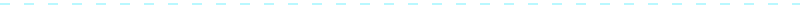

<!-- ============ 00 · HERO ============ -->

  

    
    DEVELOPER_OS / PROFILE.NEURAL
  

  

  <h1 style="margin:24px 0 6px;font-size:46px;font-weight:800;letter-spacing:2px;color:#F8FAFC;text-shadow:0 0 20px rgba(0,229,255,0.5),0 0 50px rgba(59,130,246,0.35);">Hishan Khan</h1>

  
&gt; boot sequence: DEVELOPER_OS build 2.6.0 · neural link established

  

  

    ai_engineer@dev-os:~$ let&#39;s build the intelligent layer of the internet
  

  

    
      <svg width="9" height="9" viewBox="0 0 10 10" style="flex:0 0 auto;"><circle cx="5" cy="5" r="3" fill="#00E5FF"/><circle cx="5" cy="5" r="3" fill="none" stroke="#00E5FF" stroke-width="1"><animate attributeName="r" values="3;8" dur="1.8s" repeatCount="indefinite"/><animate attributeName="opacity" values="0.7;0" dur="1.8s" repeatCount="indefinite"/></circle></svg>
      Status: <b>ONLINE</b>
    
    Learning Vertex AI
    Open to collabs
    India
    Building in public
  

  

    

      
      
      
      developer-os — zsh
    

    

      developer@dev-os:~$ whoami 
      &nbsp;&nbsp;AI + Cloud Engineer — crafting intelligent systems on Google Cloud 
      developer@dev-os:~$ stack --current 
      &nbsp;&nbsp;[&quot;Python&quot;, &quot;C&quot;, &quot;React&quot;, &quot;Next.js&quot;, &quot;Vertex AI&quot;, &quot;Gemini API&quot;, &quot;Firebase&quot;] 
      developer@dev-os:~$ status 
      &nbsp;&nbsp;&#9679; boot complete — all systems nominal &#9608;
    

  

<!-- ============ 01 · ABOUT ME ============ -->

  
  <h2 style="margin:0;font-size:18px;font-weight:700;letter-spacing:7px;color:#F1F5F9;text-transform:uppercase;">About Me</h2>
  01
  

<table align="center" cellspacing="0" cellpadding="0" style="max-width:860px;width:100%;border-collapse:separate;border-spacing:12px;">
  <tr>
    <td style="width:56%;vertical-align:top;background-color:rgba(255,255,255,0.02);border:1px solid rgba(255,255,255,0.06);border-radius:16px;padding:24px;text-align:left;">
      
# PROFILE.SELF

      
Hey, I&#39;m <b style="color:#F8FAFC;">Hishan Khan</b> — an AI + Cloud Engineer navigating the frontier where large language models meet production infrastructure.

      
I believe software should feel like intelligence — fast, calm, and alive. I&#39;m currently deep in the Google Cloud universe, wiring up Vertex AI, Gemini, and Cloud Run into things that think.

      

        Python
        Vertex AI
        Gemini API
        Cloud Run
        Next.js
      

    </td>
    <td style="width:44%;vertical-align:top;background-color:rgba(255,255,255,0.02);border:1px solid rgba(255,255,255,0.06);border-radius:16px;padding:24px;text-align:left;font-family:'Fira Code',Consolas,monospace;font-size:12.5px;line-height:2.1;">
      const engineer = { 
      &nbsp;&nbsp;name: &quot;Hishan Khan&quot;, 
      &nbsp;&nbsp;role: &quot;AI + Cloud Engineer&quot;, 
      &nbsp;&nbsp;status: &quot;actively learning&quot;, 
      &nbsp;&nbsp;focus: &quot;Vertex AI · Gemini · GenAI&quot;, 
      &nbsp;&nbsp;openTo: [&quot;collabs&quot;,&quot;hackathons&quot;], 
      &nbsp;&nbsp;learning: [&quot;React&quot;,&quot;Next.js&quot;,&quot;GCP&quot;], 
      &nbsp;&nbsp;base: &quot;India&quot; 
      }
    </td>
  </tr>
</table>

<!-- ============ 02 · LIVE STATUS ============ -->

  
  <h2 style="margin:0;font-size:18px;font-weight:700;letter-spacing:7px;color:#F1F5F9;text-transform:uppercase;">Live Status</h2>
  02
  

<table align="center" cellspacing="0" cellpadding="0" style="max-width:860px;width:100%;border-collapse:separate;border-spacing:12px;">
  <tr>
    <td style="width:25%;vertical-align:top;background-color:rgba(255,255,255,0.02);border:1px solid rgba(255,255,255,0.06);border-radius:16px;padding:18px 16px;text-align:left;">
      
SYS.STATUS

      

        <svg width="10" height="10" viewBox="0 0 10 10" style="flex:0 0 auto;"><circle cx="5" cy="5" r="3" fill="#22C55E"/><circle cx="5" cy="5" r="3" fill="none" stroke="#22C55E" stroke-width="1"><animate attributeName="r" values="3;8" dur="1.8s" repeatCount="indefinite"/><animate attributeName="opacity" values="0.7;0" dur="1.8s" repeatCount="indefinite"/></circle></svg>
        ONLINE
      

      
boot time 2.6s uptime: learning mode

    </td>
    <td style="width:25%;vertical-align:top;background-color:rgba(255,255,255,0.02);border:1px solid rgba(255,255,255,0.06);border-radius:16px;padding:18px 16px;text-align:left;">
      
SYS.FOCUS

      
Vertex AI Pipelines

      
training now on LLM + RAG

    </td>
    <td style="width:25%;vertical-align:top;background-color:rgba(255,255,255,0.02);border:1px solid rgba(255,255,255,0.06);border-radius:16px;padding:18px 16px;text-align:left;">
      
SYS.BUILD

      
RAG Assistant

      
Gemini-powered knowledge bot

    </td>
    <td style="width:25%;vertical-align:top;background-color:rgba(255,255,255,0.02);border:1px solid rgba(255,255,255,0.06);border-radius:16px;padding:18px 16px;text-align:left;">
      
SYS.MODE

      
Deep Work

      
distractions quarantined

    </td>
  </tr>
  <tr>
    <td colspan="4" style="vertical-align:top;background-color:rgba(255,255,255,0.02);border:1px solid rgba(255,255,255,0.06);border-radius:16px;padding:18px 20px;text-align:left;">
      

        

          
SYS.VIEWS — LIVE COUNTER

          
        

        

          
SYS.STREAK

          
        

      

    </td>
  </tr>
</table>

<!-- ============ 03 · TECH STACK ============ -->

  
  <h2 style="margin:0;font-size:18px;font-weight:700;letter-spacing:7px;color:#F1F5F9;text-transform:uppercase;">Tech Stack</h2>
  03
  

<table align="center" cellspacing="0" cellpadding="0" style="max-width:860px;width:100%;border-collapse:separate;border-spacing:12px;">
  <tr>
    <td style="width:50%;vertical-align:top;background-color:rgba(255,255,255,0.02);border:1px solid rgba(255,255,255,0.06);border-radius:16px;padding:20px;text-align:left;">
      
LANG.CORE

      

        Python
        C
        JavaScript
        TypeScript
        HTML + CSS
        SQL
        Bash
      

    </td>
    <td style="width:50%;vertical-align:top;background-color:rgba(255,255,255,0.02);border:1px solid rgba(255,255,255,0.06);border-radius:16px;padding:20px;text-align:left;">
      
FRONTEND.WEB

      

        React
        Next.js
        Tailwind
        Vite
      

    </td>
  </tr>
  <tr>
    <td style="width:50%;vertical-align:top;background-color:rgba(255,255,255,0.02);border:1px solid rgba(255,255,255,0.06);border-radius:16px;padding:20px;text-align:left;">
      
AI.ENGINE

      

        Vertex AI
        Gemini API
        LangChain
        RAG
        Vector DBs
        AI Agents
      

    </td>
    <td style="width:50%;vertical-align:top;background-color:rgba(255,255,255,0.02);border:1px solid rgba(255,255,255,0.06);border-radius:16px;padding:20px;text-align:left;">
      
CLOUD.OPS

      

        Google Cloud
        Cloud Run
        Firebase
        Docker
        Kubernetes
        Git / Actions
      

    </td>
  </tr>
</table>

<!-- ============ 04 · AI PROJECTS ============ -->

  
  <h2 style="margin:0;font-size:18px;font-weight:700;letter-spacing:7px;color:#F1F5F9;text-transform:uppercase;">AI Projects</h2>
  04
  

<table align="center" cellspacing="0" cellpadding="0" style="max-width:860px;width:100%;border-collapse:separate;border-spacing:12px;">
  <tr>
    <td style="width:50%;vertical-align:top;background-color:rgba(255,255,255,0.02);border:1px solid rgba(0,229,255,0.12);border-radius:16px;padding:20px;text-align:left;">
      

        <h3 style="margin:0;font-size:15px;font-weight:700;color:#F1F5F9;">Neo Browser</h3>
        IN PROGRESS
      

      
A fast, minimal browser tuned for the AI era — built-in assistant shortcuts, privacy-first tabs, and a clean command palette.

      

        JavaScript
        Electron
        WebExtensions
      

      <a href="https://github.com/khanhishan70-stack" target="_blank" rel="noopener" style="font-family:'Fira Code',Consolas,monospace;font-size:12px;color:#00E5FF;text-decoration:none;">repo &rarr;</a>
    </td>
    <td style="width:50%;vertical-align:top;background-color:rgba(255,255,255,0.02);border:1px solid rgba(255,255,255,0.06);border-radius:16px;padding:20px;text-align:left;">
      

        <h3 style="margin:0;font-size:15px;font-weight:700;color:#F1F5F9;">AI Voice Assistant</h3>
        IN PROGRESS
      

      
A hands-free assistant that listens, reasons, and acts — voice input routed through Gemini for natural conversations.

      

        Python
        Gemini API
        Speech-to-Text
      

      <a href="https://github.com/khanhishan70-stack" target="_blank" rel="noopener" style="font-family:'Fira Code',Consolas,monospace;font-size:12px;color:#00E5FF;text-decoration:none;">repo &rarr;</a>
    </td>
  </tr>
  <tr>
    <td style="width:50%;vertical-align:top;background-color:rgba(255,255,255,0.02);border:1px solid rgba(251,191,36,0.14);border-radius:16px;padding:20px;text-align:left;">
      

        <h3 style="margin:0;font-size:15px;font-weight:700;color:#F1F5F9;">Neo Study AI</h3>
        IN PROGRESS
      

      
An AI study companion that transforms messy notes into flashcards, quizzes, and summaries on demand.

      

        Next.js
        Vertex AI
        RAG
      

      <a href="https://github.com/khanhishan70-stack" target="_blank" rel="noopener" style="font-family:'Fira Code',Consolas,monospace;font-size:12px;color:#00E5FF;text-decoration:none;">repo &rarr;</a>
    </td>
    <td style="width:50%;vertical-align:top;background-color:rgba(255,255,255,0.02);border:1px solid rgba(34,197,94,0.14);border-radius:16px;padding:20px;text-align:left;">
      

        <h3 style="margin:0;font-size:15px;font-weight:700;color:#F1F5F9;">Portfolio Website</h3>
        OPEN SOURCE
      

      
My personal corner of the internet — a fast, animated portfolio that shows how I think and build.

      

        React
        Next.js
        Tailwind
      

      <a href="https://github.com/khanhishan70-stack" target="_blank" rel="noopener" style="font-family:'Fira Code',Consolas,monospace;font-size:12px;color:#00E5FF;text-decoration:none;">repo &rarr;</a>
    </td>
  </tr>
  <tr>
    <td colspan="2" style="vertical-align:top;background-color:rgba(255,255,255,0.02);border:1px solid rgba(139,92,246,0.18);border-radius:16px;padding:20px;text-align:left;">
      

        <h3 style="margin:0;font-size:15px;font-weight:700;color:#F1F5F9;">Google Cloud Projects</h3>
        IN PROGRESS
      

      
A growing collection of serverless and GenAI experiments shipped on Google Cloud — from small APIs to full applications.

      

        Google Cloud
        Vertex AI
        Cloud Run
        Firebase
      

      <a href="https://github.com/khanhishan70-stack" target="_blank" rel="noopener" style="font-family:'Fira Code',Consolas,monospace;font-size:12px;color:#00E5FF;text-decoration:none;">repo &rarr;</a>
    </td>
  </tr>
</table>

<!-- ============ 05 · GCP JOURNEY ============ -->

  
  <h2 style="margin:0;font-size:18px;font-weight:700;letter-spacing:7px;color:#F1F5F9;text-transform:uppercase;">Google Cloud Journey</h2>
  05
  

  <table style="border-collapse:collapse;border-spacing:0;width:100%;">
    <tr>
      <td style="vertical-align:top;width:46px;text-align:center;padding-top:8px;">
        

        

      </td>
      <td style="vertical-align:top;padding:0 0 26px 18px;">
        

          

            NODE_01
            COMPLETE
          

          <h3 style="margin:0 0 6px;font-size:16px;font-weight:700;color:#F1F5F9;">Cloud Foundations</h3>
          
Getting my hands on GCP — IAM, buckets, regions, and thinking cloud-native from day one.

          

            

          

          
PROGRESS_100%

        

      </td>
    </tr>
    <tr>
      <td style="vertical-align:top;width:46px;text-align:center;padding-top:8px;">
        

        

      </td>
      <td style="vertical-align:top;padding:0 0 26px 18px;">
        

          

            NODE_02
            IN PROGRESS
          

          <h3 style="margin:0 0 6px;font-size:16px;font-weight:700;color:#F1F5F9;">Generative AI Fundamentals</h3>
          
Prompt design, Gemini models, grounding, and turning tokens into reliable product features.

          

            

          

          
PROGRESS_55%

        

      </td>
    </tr>
    <tr>
      <td style="vertical-align:top;width:46px;text-align:center;padding-top:8px;">
        

        

      </td>
      <td style="vertical-align:top;padding:0 0 26px 18px;">
        

          

            NODE_03
            IN PROGRESS
          

          <h3 style="margin:0 0 6px;font-size:16px;font-weight:700;color:#F1F5F9;">Building AI Apps</h3>
          
Shipping serverless apps on Cloud Run with Firebase auth and fast, global serving.

          

            

          

          
PROGRESS_35%

        

      </td>
    </tr>
    <tr>
      <td style="vertical-align:top;width:46px;text-align:center;padding-top:8px;">
        

      </td>
      <td style="vertical-align:top;padding:0 0 0 18px;">
        

          

            NODE_04
            QUEUED
          

          <h3 style="margin:0 0 6px;font-size:16px;font-weight:700;color:#CBD5E1;">MLOps & Production AI</h3>
          
Vertex AI Pipelines, model evaluation, monitoring drift, and operating AI systems end-to-end.

          

            

          

          
PROGRESS_0%

        

      </td>
    </tr>
  </table>

<!-- ============ 06 · GITHUB ANALYTICS ============ -->

  
  <h2 style="margin:0;font-size:18px;font-weight:700;letter-spacing:7px;color:#F1F5F9;text-transform:uppercase;">GitHub Analytics</h2>
  06
  

<table align="center" cellspacing="0" cellpadding="0" style="max-width:860px;width:100%;border-collapse:separate;border-spacing:12px;">
  <tr>
    <td style="width:50%;vertical-align:top;background-color:rgba(255,255,255,0.02);border:1px solid rgba(255,255,255,0.06);border-radius:16px;padding:16px;text-align:center;">
      
    </td>
    <td style="width:50%;vertical-align:top;background-color:rgba(255,255,255,0.02);border:1px solid rgba(255,255,255,0.06);border-radius:16px;padding:16px;text-align:center;">
      
    </td>
  </tr>
  <tr>
    <td colspan="2" style="vertical-align:top;background-color:rgba(255,255,255,0.02);border:1px solid rgba(255,255,255,0.06);border-radius:16px;padding:16px;text-align:center;">
      
    </td>
  </tr>
  <tr>
    <td colspan="2" style="vertical-align:top;background-color:rgba(255,255,255,0.02);border:1px solid rgba(255,255,255,0.06);border-radius:16px;padding:16px;text-align:center;">
      
    </td>
  </tr>
</table>

<!-- ============ 07 · CERTIFICATIONS ============ -->

  
  <h2 style="margin:0;font-size:18px;font-weight:700;letter-spacing:7px;color:#F1F5F9;text-transform:uppercase;">&#128204; Certifications</h2>
  07
  

<table align="center" cellspacing="0" cellpadding="0" style="max-width:860px;width:100%;border-collapse:separate;border-spacing:12px;">
  <tr>
    <td style="width:33.33%;vertical-align:top;background-color:rgba(255,255,255,0.02);border:1px solid rgba(0,229,255,0.14);border-radius:16px;padding:20px;text-align:left;">
      
&#9632;

      <h3 style="margin:0 0 6px;font-size:15px;font-weight:700;color:#F1F5F9;">Google Cloud Arcade</h3>
      
Hands-on quests &amp; labs across the Google Cloud universe.

      
        <svg width="8" height="8" viewBox="0 0 10 10" style="flex:0 0 auto;"><circle cx="5" cy="5" r="3" fill="#00E5FF"/><circle cx="5" cy="5" r="3" fill="none" stroke="#00E5FF" stroke-width="1"><animate attributeName="r" values="3;8" dur="1.8s" repeatCount="indefinite"/><animate attributeName="opacity" values="0.7;0" dur="1.8s" repeatCount="indefinite"/></circle></svg>
        COMING SOON
      
    </td>
    <td style="width:33.33%;vertical-align:top;background-color:rgba(255,255,255,0.02);border:1px solid rgba(0,229,255,0.14);border-radius:16px;padding:20px;text-align:left;">
      
&#9632;

      <h3 style="margin:0 0 6px;font-size:15px;font-weight:700;color:#F1F5F9;">Google Cloud Skill Badges</h3>
      
GenAI, Vertex AI, and Cloud Run skill tracks.

      
        <svg width="8" height="8" viewBox="0 0 10 10" style="flex:0 0 auto;"><circle cx="5" cy="5" r="3" fill="#00E5FF"/><circle cx="5" cy="5" r="3" fill="none" stroke="#00E5FF" stroke-width="1"><animate attributeName="r" values="3;8" dur="1.8s" repeatCount="indefinite"/><animate attributeName="opacity" values="0.7;0" dur="1.8s" repeatCount="indefinite"/></circle></svg>
        COMING SOON
      
    </td>
    <td style="width:33.33%;vertical-align:top;background-color:rgba(255,255,255,0.02);border:1px solid rgba(255,255,255,0.06);border-radius:16px;padding:20px;text-align:left;">
      
&#9632;

      <h3 style="margin:0 0 6px;font-size:15px;font-weight:700;color:#F1F5F9;">Google Cloud Certifications</h3>
      
Professional-level credentials — cloud &amp; AI track.

      FUTURE
    </td>
  </tr>
  <tr>
    <td style="width:33.33%;vertical-align:top;background-color:rgba(255,255,255,0.02);border:1px solid rgba(255,255,255,0.06);border-radius:16px;padding:20px;text-align:left;">
      
&#9632;

      <h3 style="margin:0 0 6px;font-size:15px;font-weight:700;color:#F1F5F9;">Python Certification</h3>
      
Foundations of Python for data &amp; AI work.

      FUTURE
    </td>
    <td style="width:33.33%;vertical-align:top;background-color:rgba(255,255,255,0.02);border:1px solid rgba(255,255,255,0.06);border-radius:16px;padding:20px;text-align:left;">
      
&#9632;

      <h3 style="margin:0 0 6px;font-size:15px;font-weight:700;color:#F1F5F9;">AI &amp; GenAI Certifications</h3>
      
Generative AI and applied machine learning.

      FUTURE
    </td>
    <td style="width:33.33%;vertical-align:middle;text-align:center;">
      
AWAITING_DEPLOYMENT... every cert stars with a single lab

    </td>
  </tr>
</table>

<!-- ============ 08 · LEARNING ROADMAP ============ -->

  
  <h2 style="margin:0;font-size:18px;font-weight:700;letter-spacing:7px;color:#F1F5F9;text-transform:uppercase;">&#128506; Learning Roadmap</h2>
  08
  

  <table style="border-collapse:collapse;border-spacing:0;width:100%;">
    <tr>
      <td style="vertical-align:top;width:46px;text-align:center;padding-top:8px;">
        

        

      </td>
      <td style="vertical-align:top;padding:0 0 26px 18px;">
        

          

            PHASE_1 &#10004;
            COMPLETE
          

          <h3 style="margin:0 0 10px;font-size:16px;font-weight:700;color:#F1F5F9;">Foundation Core</h3>
          

            C Programming
            Python
            Git &amp; GitHub
          

          

            

          

          
PROGRESS_100%

        

      </td>
    </tr>
    <tr>
      <td style="vertical-align:top;width:46px;text-align:center;padding-top:8px;">
        

        

      </td>
      <td style="vertical-align:top;padding:0 0 26px 18px;">
        

          

            PHASE_2 &#128260;
            IN PROGRESS
          

          <h3 style="margin:0 0 10px;font-size:16px;font-weight:700;color:#F1F5F9;">Web Engineering</h3>
          

            HTML
            CSS
            JavaScript
            React
            Next.js
          

          

            

          

          
PROGRESS_45%

        

      </td>
    </tr>
    <tr>
      <td style="vertical-align:top;width:46px;text-align:center;padding-top:8px;">
        

        

      </td>
      <td style="vertical-align:top;padding:0 0 26px 18px;">
        

          

            PHASE_3 &#128260;
            IN PROGRESS
          

          <h3 style="margin:0 0 10px;font-size:16px;font-weight:700;color:#F1F5F9;">Google Cloud &amp; GenAI</h3>
          

            Google Cloud
            Gemini API
            Vertex AI
            Firebase
            Cloud Run
          

          

            

          

          
PROGRESS_30%

        

      </td>
    </tr>
    <tr>
      <td style="vertical-align:top;width:46px;text-align:center;padding-top:8px;">
        

        

      </td>
      <td style="vertical-align:top;padding:0 0 26px 18px;">
        

          

            PHASE_4 &#9203;
            QUEUED
          

          <h3 style="margin:0 0 10px;font-size:16px;font-weight:700;color:#CBD5E1;">AI Systems</h3>
          

            Docker
            Kubernetes
            LangChain
            Vector Databases
            RAG
            AI Agents
          

          

            

          

          
PROGRESS_0%

        

      </td>
    </tr>
    <tr>
      <td style="vertical-align:top;width:46px;text-align:center;padding-top:8px;">
        

      </td>
      <td style="vertical-align:top;padding:0 0 0 18px;">
        

          

            PHASE_5 &#9203;
            QUEUED
          

          <h3 style="margin:0 0 10px;font-size:16px;font-weight:700;color:#CBD5E1;">Production AI</h3>
          

            MLOps
            System Design
            DevOps
            Production AI Systems
          

          

            

          

          
PROGRESS_0%

        

      </td>
    </tr>
  </table>

<!-- ============ 09 · CONTACT ============ -->

  
  <h2 style="margin:0;font-size:18px;font-weight:700;letter-spacing:7px;color:#F1F5F9;text-transform:uppercase;">Contact</h2>
  09
  

  
Initiate a secure transmission — let&#39;s build something intelligent together.

  

    <a href="https://github.com/khanhishan70-stack" target="_blank" rel="noopener" style="display:inline-flex;align-items:center;gap:9px;padding:10px 22px;border-radius:99px;background-color:rgba(255,255,255,0.03);border:1px solid rgba(255,255,255,0.14);font-size:13px;font-weight:600;color:#E2E8F0;text-decoration:none;">&#9670; GitHub</a>
  

  
more channels coming soon

<!-- ============ 10 · FOOTER ============ -->

  
  
© 2026 Hishan Khan — DEVELOPER_OS v2.6.0

  
crafted with precision · powered by curiosity

  <a href="#top" style="display:inline-block;margin-top:6px;font-family:'Fira Code',Consolas,monospace;font-size:11px;letter-spacing:2px;color:#00E5FF;text-decoration:none;">&#9650; back to top</a>

